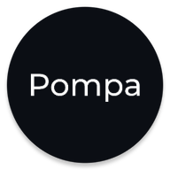
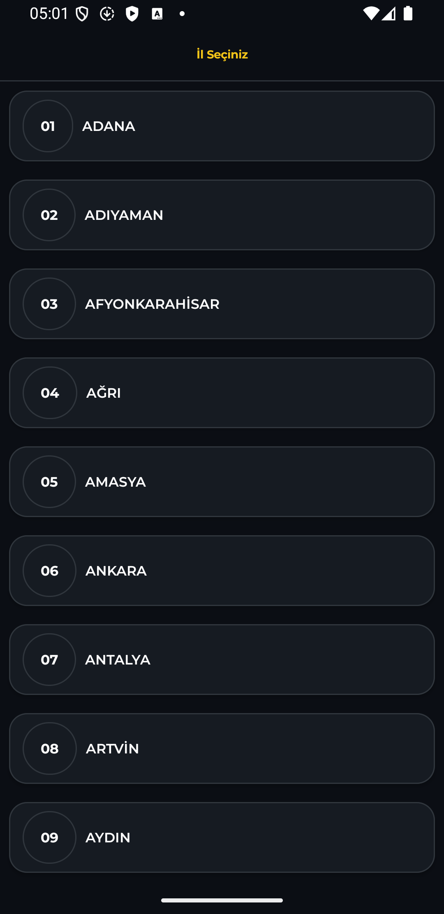
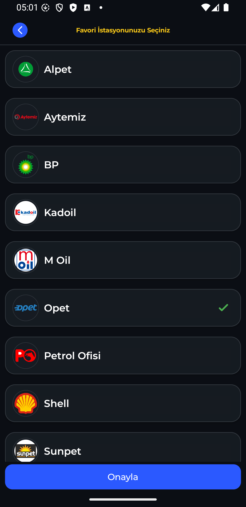
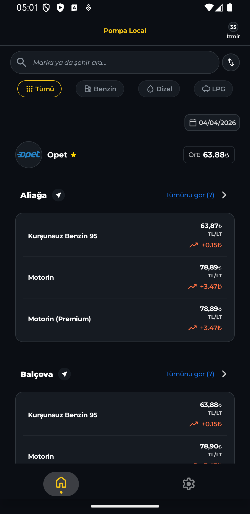
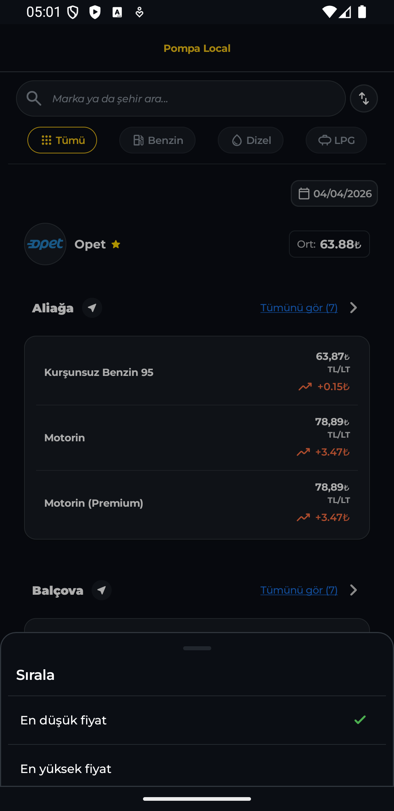
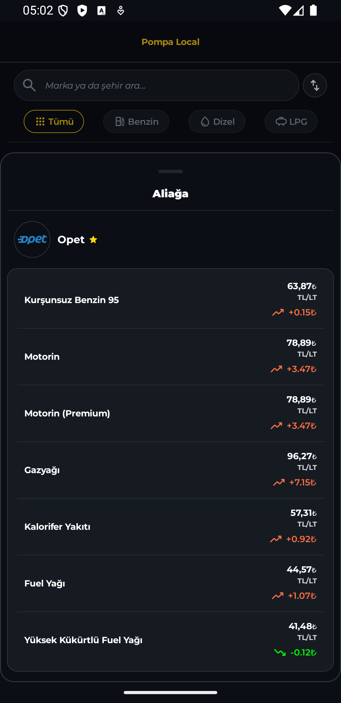
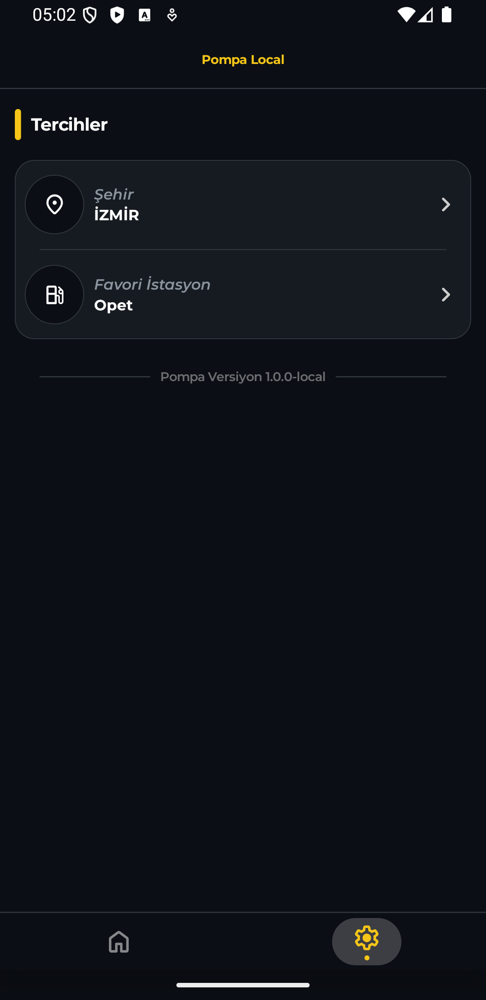

# Pompa

<br clear="left" />

Pompa is an Android app for browsing fuel prices in Turkey by province, provider, and district.

The app is built with Kotlin and Jetpack Compose, supports multiple environments, and includes responsive layouts for phones and larger screens.

## Features

- Browse fuel prices by province and provider
- View district-level fuel details in a bottom sheet
- Search and filter prices on the home screen
- Sort price results
- Pull to refresh on main listing screens
- Responsive layouts for phone and tablet-style widths
- Provider logo loading with image caching
- Firebase Cloud Messaging integration
- AdMob banner integration

## Screenshots

| Home | Provider Cards | Provinces |
| --- | --- | --- |
|  |  |  |

| Providers | Details | Tablet |
| --- | --- | --- |
|  |  |  |

## Tech Stack

- Kotlin
- Jetpack Compose
- Material 3
- Navigation Compose
- Hilt
- Retrofit
- OkHttp
- Moshi
- Kotlinx Serialization
- DataStore
- Coil
- Firebase Analytics
- Firebase Cloud Messaging
- Firebase Crashlytics
- Google Mobile Ads SDK

## Project Structure

Main app code lives under:

- `app/src/main/java/com/pompa/android`

Notable areas:

- `features/home`: home screen, filters, search, and price listing
- `features/provinces`: province selection flow
- `features/providers`: provider listing
- `features/district_fuel_price_details`: fuel detail bottom sheet
- `network`: Retrofit and API wiring
- `data/datastore`: local preference storage
- `notification`: FCM and local notification handling
- `ui`: shared components, theme, and layout utilities

## Build Flavors

The app currently uses three environment flavors:

- `local`: local backend, test ads
- `dev`: dev backend, test ads
- `prod`: production backend, production ads

## Requirements

- Android Studio
- A valid `local.properties` file
- `google-services.json` for Firebase

## Local Configuration

This project reads environment values from `local.properties`.

Example:

```properties
sdk.dir=/path/to/Android/sdk

POMPA_LOCAL_EMULATOR_BASE_URL=http://10.0.2.2:5001/api/v1/
POMPA_LOCAL_BASE_URL=http://192.168.x.x:5001/api/v1/

EMULATOR_IMAGE_BASE_URL=http://10.0.2.2:5001/
IMAGE_BASE_URL=http://192.168.x.x:5001/

POMPA_DEV_BASE_URL=https://dev-api.example.com/api/v1/
POMPA_DEV_IMAGES_BASE_URL=https://dev-api.example.com/assets/images

POMPA_BASE_URL=https://api.example.com/api/v1/
POMPA_IMAGES_BASE_URL=https://api.example.com/assets/images

ADMOB_APP_ID=your-admob-app-id
ADMOB_BANNER_UNIT_ID=your-admob-banner-unit-id
```

Notes:

- On the Android emulator, use `10.0.2.2` to reach a backend running on your machine.
- On a physical device, use your computer's LAN IP for the local backend.
- `local` is intended for a backend running on your machine.
- `dev` points to the hosted development API.
- `prod` points to the hosted production API.
- Image base URL values are included for environment-specific asset hosting.
- Keep `local.properties` and Firebase credentials out of version control.
- Real AdMob IDs should only be used when your AdMob account and app are ready for production serving.

## Running The App

From Android Studio:

1. Open the project.
2. Sync Gradle.
3. Choose a build variant such as `localDebug`, `devDebug`, or `prodDebug`.
4. Run the app on an emulator or physical device.

From the command line:

```bash
./gradlew assembleLocalDebug
./gradlew assembleDevDebug
./gradlew assembleProdDebug
```

## Backend Notes

Pompa expects a backend that serves:

- API responses under an `/api/v1/` base path
- provider and brand images under an assets path

The app also rewrites backend asset URLs to the active environment host when needed, which helps local and hosted environments behave consistently.

## UI Notes

- The home screen supports search, filters, sorting, and pull to refresh.
- Tablet-style layouts switch to a side navigation rail and grid-based content.
- Province and home listings adapt their column count based on available width.

## Notifications And Ads

- Firebase Cloud Messaging is used for push notifications.
- AdMob is initialized in the application layer.
- Debug and non-production environments are set up to use test banner ads.

## Status

This project is actively evolving. Public cleanup, documentation, and setup polish are still ongoing.

## License

No license has been added yet.

If you plan to make the repository public, add a license before publishing.
